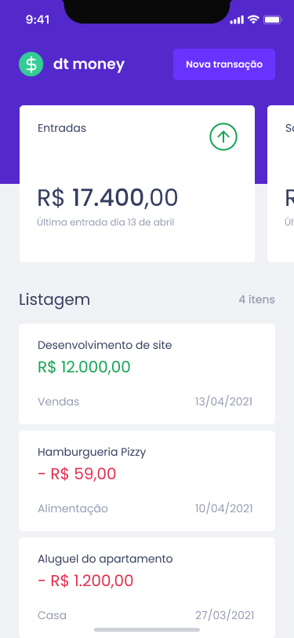
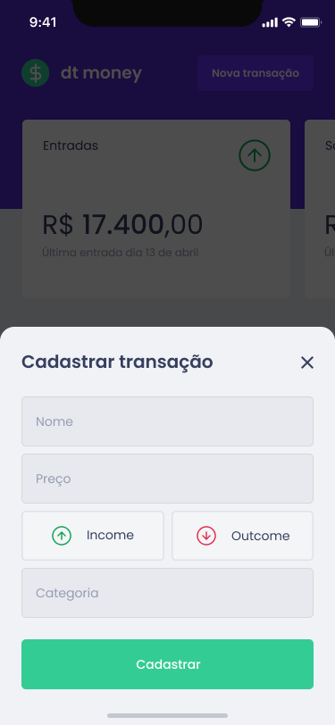

<h1 align="center">
  
</h1>

</br>

<div align="center">
  <div style="display: flex; justify-content: space-between; gap: 15%; align-items: center; padding-right: 15%; width: 12rem;">
    
    
  </div>
  <div style="width: 34rem; padding-top: 15px;">
    
  </div>

</div>

## 📚 About

DT Money is a personal financial account control that registers incoming and outgoing accounts, totals in cards using a Fake API MirajeJS library that uses the JSON format to make the entries. 


## 🚀 Technology

- [Vite](https://vitejs.dev/guide/)
- [React](https://pt-br.reactjs.org/tutorial/tutorial.html)
- [TypeScript](https://www.typescriptlang.org/)
- [hooks](https://reactjs.org/docs/hooks-intro.html)
- [Axios](https://www.npmjs.com/package/axios)
- [Styled-Component](https://www.npmjs.com/package/styled-components)


## 🏃‍♂️ Run Project

```bash
# Clone this repository to start

$ git clone https://github.com/tmz81/dtmoney.git

# Access the directory dtmoney
$ cd dtmoney

# Instal the dependencies

$ npm install

# Run the project

$ npm start

# Access http://localhost:3000 in your browser
```